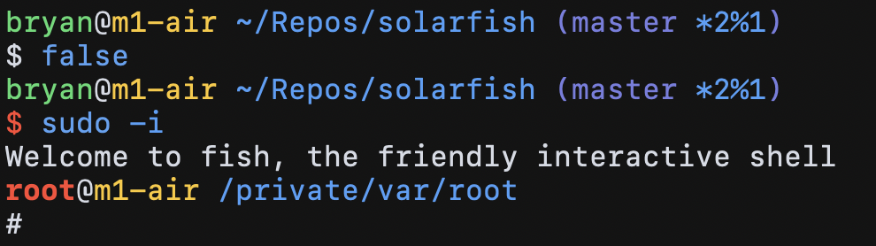

# solarfish

A git-aware two-line [fish shell](https://fishshell.com) theme. Inspired by [simple-ass-prompt](https://github.com/lfiolhais/theme-simple-ass-prompt) and the default bash prompt.



## Features

- Two-line prompt
- Git status icons: dirty `*`, staged `+`, ahead `↑`, behind `↓`, diverged `⥄`
- Previous command status (prompt turns red on error)
- Root user indicator (username turns red when running as root)
- Remote host indicator (hostname turns red when running under a ssh connection)

## Install

Using [fisher](https://github.com/jorgebucaran/fisher):

```sh
fisher install thesilican/solarfish
```


## Configuration

Add configuration changes to your `~/.config/fish/config.fish` file.

```sh
# Disable the git indicator
set -g theme_no_git yes
```
